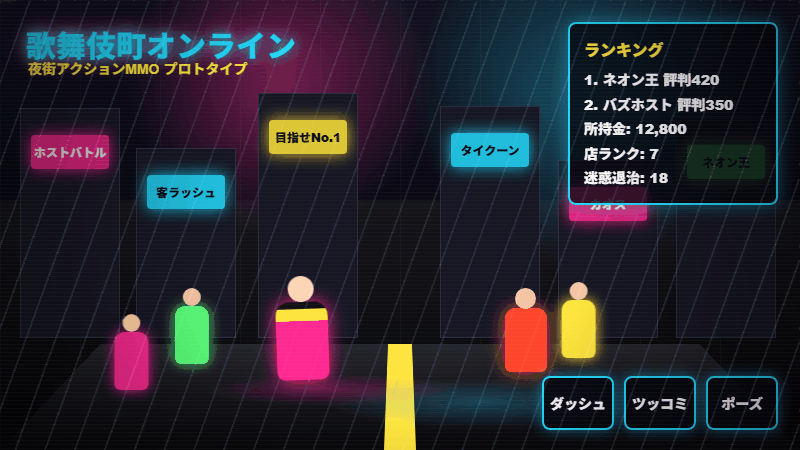

# Kabukicho Online

Roblox向けの夜街ソーシャルアクションMMOプロトタイプです。恋愛・出会い目的ではなく、評判、カリスマ、店ランキング、PvP、カオスイベントで盛り上がる短時間プレイを軸にしています。

## Play Now

GitHub Pages版のブラウザミニゲーム:

https://jim-auto.github.io/kabukicho-online/



このGIFはPlaywrightでGitHub Pages版を自動撮影したものです。背景には生成画像アセットを使っています。Roblox版はStudioでRojo同期後にPlayして確認します。

## 実行方法

1. Roblox Studioで空のPlaceを開く
2. Rojoを使う場合は、このリポジトリで `rojo serve`
3. Studio側でRojoプラグインから接続
4. Playを押す

## デモGIF生成

```powershell
npm run capture:demo
```

## GitHub Pages版の確認

```powershell
npm run smoke:pages
```

## 実装済みMVP

- 三人称標準移動に加えたダッシュ
- 近距離BONK/PUSH PvP
- 迷惑NPCをコメディ調に退場させるTroublePoints
- AI生成キャラ画像によるプレイヤー/客/迷惑NPCスプライト
- 女性NPCを多めに配置し、客引き/ツッコミ退場の近距離インタラクションを強化
- WASD/矢印/クリック移動で街を走り回るアクション操作
- NPC群衆とProximityPromptによる客集め
- Money / Reputation / Charisma / ClubRank
- ランキング取得
- 店ランク上昇
- エモート
- ネオン街の自動生成
- ランダムなカオスイベント
- 物理で転がる街ギミック
- モバイル向けボタンUI

## 推奨フォルダ構成

```text
src/
  shared/
    Constants.lua
    GameConfig.lua
    Util.lua
  server/
    Main.server.lua
    RemoteBootstrap.lua
    WorldBuilder.lua
    PlayerDataService.lua
    EconomyService.lua
    RankingService.lua
    NPCService.lua
    PvPService.lua
    ChaosEventService.lua
  client/
    Main.client.lua
docs/
  GAME_DESIGN.md
  ROADMAP.md
```

## Roblox規約配慮

このプロトタイプでは「恋愛」「デート」「マッチング」系の仕組みを入れていません。NPCは「ファン」「観光客」「配信者」などの街の客として扱い、報酬は評判、SNS人気、店ランキング、金、カリスマに寄せています。
